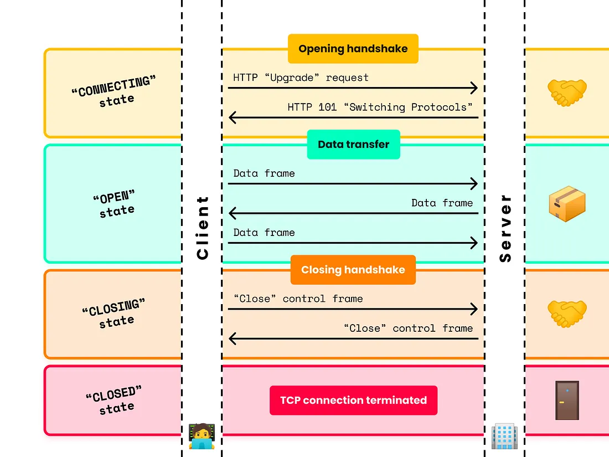

# Websocket:
   * A web socket is a two way communication protocol
   * It is used to share data at the same time
   * Unlike HTTP we dont have request response 
   * The server and client can communicate independently whenever it needs
   * They make connection only once and maintian their state
   * They are stateful.
   
## Life cycle of Websocket

   * **Connecting State**
   * **Open State**
   * **Closing State**
   * **Closed State**

### Connecting state
   * Connecting state or opening state is the state where the connection of the websockets start.
   * They make HTTP request in the beginning.
   * This is just the request part where the request is sent from the client to the server to connect.

**Request structure**:
GET /chat HTTP/1.1
Host: server.example.com
Connection: upgrade
Upgrade: websocket
Origin: <http://example.com>
Sec-WebSocket-Key: NnRlZW4gYnl0ZXMgbG9uZw==
Sec-WebSocket-Protocol: html-chat, text-chat
Sec-WebSocket-Version: 13

## Open State:
   * This state is achieved once when the server accepts the connection. 
   * The server sends 
    HTTP/1.1 101 Switching Protocols
    Connection: upgrade
    Upgrade: websocket
    Sec-WebSocket-Accept: 5TJpHv9RoAl7w8ytsXcWxTOZ9Q==
    Sec-WebSocket-Protocol: new-chat 

* The *Sec-Websocket-Accept* is used to make the connection connected.
* It is a combination of the sec-websocket-key + arbitrary constant held by the server
* This combination is hashed with sha-1 and then encoded with base64

### Data Transfer:
   * FIN bit 
   * RSV bit
   